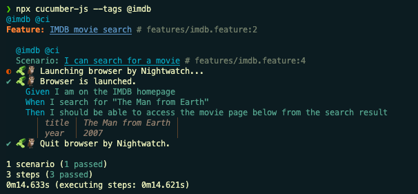

# cucumber-nightwatch 🥒 + 🦉
[](https://github.com/tim-yao/cucumber-nightwatch/actions/workflows/test.yml) [](https://badge.fury.io/js/cucumber-nightwatch)

> A small library to enable us to use nightwatch.js in cucumber.js



## Installation

```bash
npm install @cucumber/cucumber nightwatch cucumber-nightwatch
```

## Cucumber configuration

Before start, please follow the [Cucumber-js document](https://github.com/cucumber/cucumber-js#get-started) to setup your Cucumber-js.
After that, then add below in your Cucumber-js hooks file.

```JavaScript
const{
  Before,
  After
} = require('@cucumber/cucumber')
const { NightwatchWorld } = require('cucumber-nightwatch')

setWorldConstructor(NightwatchWorld)

// Launch the browser session before each test scenario
Before(async function () {
  await this.initNightwatch()
})

// Close the browser session after each test scenario
After(async function () {
  await this.endNightwatch()
})
```

If you are using TypeScript, use below examples:

```TypeScript
import {
  Before,
  After
} from '@cucumber/cucumber'
import NightwatchWorld from 'cucumber-nightwatch'

setWorldConstructor(NightwatchWorld)

// Launch the browser session before each test scenario
Before(async function (this: NightwatchWorld) {
  await this.initNightwatch()
})

// Close the browser session after each test scenario
After(async function (this: NightwatchWorld) {
  await this.endNightwatch()
})
```

### Step definitions

After we have the above cucumber hooks setup completed. We can write step definition to use Nightwatch.js like below examples.

**JavaScript**:

```JavaScript
Given('I visit the Google AU homepage', function () {
  this.browser.url('https://google.com.au')
})

When('I check the page title', async function () {
  this.pageTitle = await this.browser.getTitle()
})

Then('the title text should be {string}', async function (title) {
  await this.browser.assert.equal(this.pageTitle, title)
})
```

**TypeScript**:

```TypeScript
import NightwatchWorld from 'cucumber-nightwatch'

Given('I visit the Google AU homepage', function (this: NightwatchWorld) {
  this.browser!.url('https://google.com.au')
})

When('I check the page title', async function (this: NightwatchWorld) {
  this.pageTitle = await this.browser!.getTitle()
})

Then('the title text should be {string}', async function (this: NightwatchWorld, title: string) {
  await this.browser!.assert.equal(this.pageTitle, title)
})
```

### Run tests

Run tests by using cucumber-js

```bash
npx cucumber-js
```

Run with [cucumber-js options](https://github.com/cucumber/cucumber-js/blob/main/docs/configuration.md#options)

```bash
npx cucumber-js --tags "@regression" --parallel 4 --retry 2 
```

More details can be found in [cucumber-js CLI](https://github.com/cucumber/cucumber-js/blob/main/docs/cli.md)

## Nightwatch configuration

There is no configurations required to run the tests by default.

You will need to setup [Nigthwatch.js configuration file](https://nightwatchjs.org/guide/configuration/nightwatch-configuration-file.html) first. If you don't have one in project root dir, the first time run should generate one for you automatically.

But you can use below optional environment variables to configure the Nightwatch [runner options](https://nightwatchjs.org/guide/running-tests/using-the-cli-test-runner.html#runner-options)

```shell
# Specify your testing environment to use, same as --env
NIGHTWATCH_BROWSER=chrome
# Default is false. Set to true to enable --headless
NIGHTWATCH_HEADLESS=true
# Default is using root config file. --config
NIGHTWATCH_CONFIG=./custom_dir/nightwatch.conf.js
# Default is 10000ms. --timeout
NIGHTWATCH_TIMEOUT=10000
# Default is true. Set to false to enable --verbose
NIGHTWATCH_SILENT=false
# Default is false. Set to true to enable logs
NIGHTWATCH_OUTPUT=true
# Default is true. Set to false to disable parallel. If you run cucumber-js in parallel, this need to be true.
NIGHTWATCH_PARALLEL=false
```

## Cucumber Nightwatch configuration

```shell
# Enable verbose log to see how nightwatch browser start and exit
CN_DEBUG=true
```

## Known issues 🐛

There are some bugs in Nightwatch.js programmatic API. See https://github.com/tim-yao/cucumber-nightwatch/issues/6
